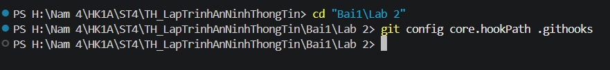
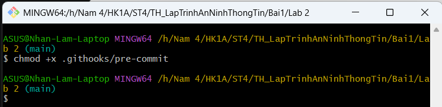
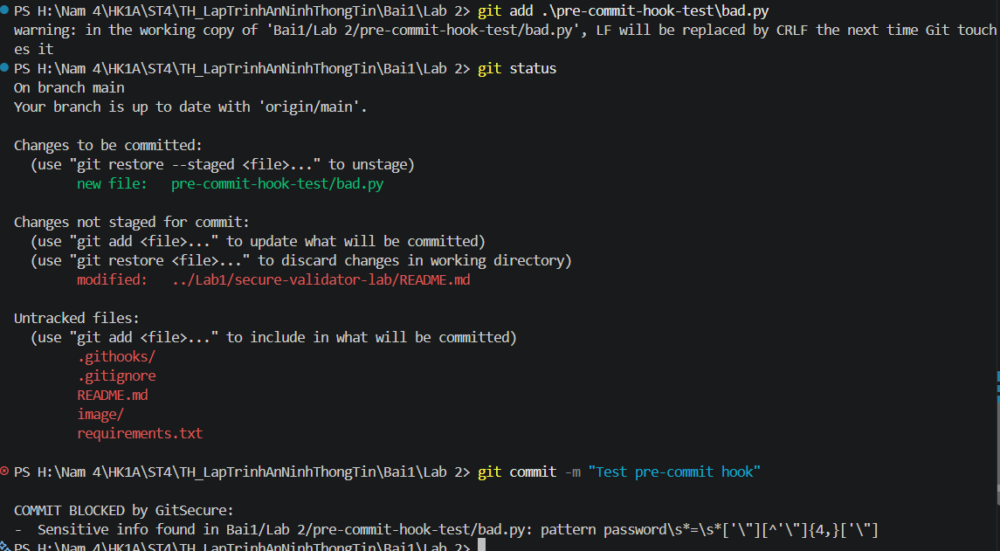

# BÁO CÁO BÀI TẬP THỰC HÀNH
## BÀI 1: CƠ SỞ LẬP TRÌNH BẢO MẬT, KIỂM TRA ĐẦU VÀO
### Lab 2: Tự động hóa kiểm tra an toàn mã nguồn với Git Hooks (GitSecure)

---

### 📋 Thông tin chung
- **Môn học:** Lập trình An ninh Thông tin / Lập trình An toàn
- **Sinh viên thực hiện:** [Nhan Huỳnh Lâm]
- **Mã số sinh viên (MSSV):** [2387700037]
- **Lớp / Nhóm:** ST4

---

## 1. Mục tiêu bài thực hành

Triển khai cơ chế **DevSecOps** ở mức mã nguồn cục bộ (Client-side Git Hooks) thông qua công cụ **GitSecure**:
1. **Phát hiện rò rỉ bí mật (Secret Scanning):** Quét và chặn kịp thời các dữ liệu nhạy cảm như API Key, Secret Token, Mật khẩu hardcoded trước khi mã nguồn được commit vào Git.
2. **Kiểm tra đặc quyền tệp (File Permissions):** Ngăn chặn việc đẩy các tệp có quyền ghi quá thoáng (`world-writable` - 777) lên kho mã nguồn.
3. **Phân tích tĩnh mã nguồn (SAST với Bandit):** Tự động phát hiện các lỗ hổng mã nguồn Python ở mức độ nghiêm trọng cao (`SEVERITY: High`).
4. **Kiểm toán và ghi vết (Audit Logging):** Tự động lưu vết toàn bộ hành vi vi phạm bảo mật vào tệp nhật ký `gitsecure.log`.

---

## 2. Cấu trúc thư mục bài Lab

```text
LAB_2/
├── .githooks/
│   └── pre-commit          # Script hook chính (Python) thực thi kiểm tra trước khi commit
├── requirements.txt         # Khai báo dependency: bandit
├── .gitignore              # Chỉnh sửa để thêm gitsecure.log và .venv vào danh sách bỏ qua
├── gitsecure.log           # File log tự động được tạo ra để ghi nhận phát hiện khi chạy hook
├── pre-commit-hook-test/   # Thư mục thử nghiệm
│   └── bad.py              # File thử nghiệm chứa thông tin nhạy cảm để kiểm tra hook
├── image/                  # Thư mục lưu trữ hình ảnh minh chứng thực nghiệm
│   ├── image1.png          # Ảnh minh chứng cấu hình Git hook
│   ├── image2.png          # Ảnh minh chứng cấp quyền thực thi chmod +x
│   └── image3.png          # Ảnh minh chứng GitSecure chặn commit vi phạm
├── .venv/                  # Môi trường ảo chứa Bandit (được loại trừ khỏi repo)
└── README.md               # Báo cáo và hướng dẫn chi tiết
```

---

## 3. Kiến trúc & Các cơ chế bảo mật đã triển khai

| Cơ chế kiểm tra | Mô tả kỹ thuật | Mục tiêu ngăn chặn |
| :--- | :--- | :--- |
| **Sensitive Data Scanner** | Sử dụng Regular Expression để kiểm tra các mẫu: `apikey`, `secret`, `password`, `token`, AWS Key (`AKIA`/`ASIA`). | Chống rò rỉ credential và khóa truy cập lên kho mã nguồn công cộng. |
| **Permission Check** | Sử dụng thư viện `stat` kiểm tra cờ bit `stat.S_IWOTH` (world-writable). Có xử lý tương thích cho Windows (`platform.system() == "Windows"`). | Tránh lỗi cấu hình phân quyền tệp quá lỏng lẻo. |
| **Bandit SAST Scanner** | Chạy `bandit -r .` quét toàn bộ dự án, bắt các cảnh báo mức `SEVERITY: High`. | Phòng ngừa các lỗ hổng Injection, Deserialization, Hardcoded secrets,... |
| **Audit Logger** | Ghi log thời gian thực vào `gitsecure.log` theo định dạng: `[YYYY-MM-DD hh:mm:ss] <Nội dung vi phạm>`. | Lưu vết phục vụ đánh giá và rà soát an toàn thông tin. |

---

## 4. Hướng dẫn cài đặt & Kích hoạt Hook

### Bước 1: Kích hoạt môi trường ảo & cài đặt thư viện
```bash
# Kích hoạt .venv trên Windows PowerShell
.venv\Scripts\Activate.ps1

# Hoặc trên Windows Command Prompt:
.venv\Scripts\activate.bat

# Hoặc trên Git Bash / Linux:
source .venv/Scripts/activate

# Cài đặt Bandit nếu cần
pip install -r requirements.txt
```

### Bước 2: Cấu hình Git Hook
Trỏ cấu hình `core.hooksPath` của Git vào thư mục `.githooks`:
```bash
git config core.hooksPath .githooks
```


*Hình 1: Thực hiện lệnh cấu hình đường dẫn Git hook trong PowerShell (`git config core.hooksPath .githooks`).*

*(Nếu sử dụng Linux / macOS / Git Bash, cấp quyền thực thi cho hook)*:
```bash
chmod +x .githooks/pre-commit
```


*Hình 2: Cấp quyền thực thi (`chmod +x .githooks/pre-commit`) trên môi trường Git Bash.*

---

## 5. Kịch bản kiểm thử & Kết quả thực nghiệm

### Kịch bản 1: Commit file chứa mật khẩu hardcoded (Bị chặn)

1. Tạo thư mục thử nghiệm `pre-commit-hook-test` và file `bad.py`:
   ```python
   password = "123456"
   ```
2. Đưa vào staging và thực hiện commit:
   ```bash
   git add pre-commit-hook-test/bad.py
   git commit -m "Test pre-commit hook"
   ```
3. **Kết quả thực tế (Terminal Output):**
   ```text
   COMMIT BLOCKED by GitSecure:
   -  Sensitive info found in Bai1/Lab 2/pre-commit-hook-test/bad.py: pattern password\s*=\s*['"][^'"]{4,}['"]
   ```
   *👉 Git huỷ bỏ commit thành công (Exit Code: 1).*


*Hình 3: Kết quả thực tế khi thực hiện `git add` và `git commit`: Git hook tự động kích hoạt, phát hiện mật khẩu hardcoded và chặn commit ngay lập tức.*

---

### Kịch bản 2: Kiểm tra tệp nhật ký kiểm toán (`gitsecure.log`)

Khi mở tệp `gitsecure.log`, toàn bộ thông tin vi phạm đã được ghi lại:
```text
[2026-09-23 15:19:48.858975] Sensitive info found in pre-commit-hook-test/bad.py: pattern password\s*=\s*['"][^'"]{4,}['"]
```

---

### Kịch bản 3: Khắc phục vi phạm bảo mật & Commit thành công

1. Xoá mật khẩu nhạy cảm khỏi file `bad.py` hoặc sử dụng biến môi trường:
   ```python
   import os
   password = os.getenv("APP_PASSWORD")
   ```
2. Đưa vào staging và commit lại:
   ```bash
   git add pre-commit-hook-test/bad.py
   git commit -m "Fix: remove hardcoded password"
   ```
3. **Kết quả thực tế (Terminal Output):**
   ```text
   GitSecure: All checks passed.
   [main 4d13d15] Fix: remove hardcoded password
    1 file changed, 2 insertions(+)
   ```
   *👉 Hook thông qua và commit được lưu vào Git repository bình thường (Exit Code: 0).*

---

## 6. Các điểm cải tiến & Tương thích môi trường

1. **Tương thích đa nền tảng (Windows & Linux/macOS):**
   - Đã xử lý phân quyền trên Windows thông qua `platform.system() == "Windows"` để tránh lỗi False Positive (file mặc định bị nhận diện là world-writable trên NTFS).
   - Tự động trỏ đúng đường dẫn thực thi của Bandit tại `.venv/Scripts/bandit.exe` (Windows) hoặc `.venv/bin/bandit` (Unix).
2. **Bảo mật tệp nhật ký:**
   - Đã khai báo `gitsecure.log` và `.venv/` trong `.gitignore` để tránh việc vô tình commit các thông tin nhạy cảm đã bị ghi log ngược lại vào repository.
3. **Tối ưu hóa hiệu năng quét Bandit:**
   - Cấu hình cờ `-x ./.venv` loại trừ thư viện bên thứ 3 trong môi trường ảo, giúp tốc độ quét diễn ra tức thì (< 1 giây).
