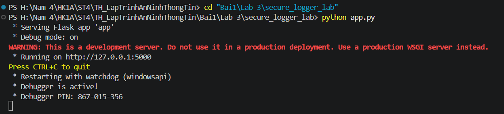
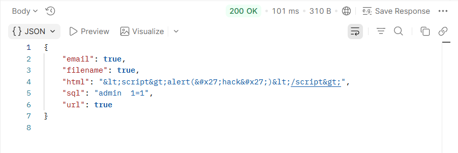

# BÁO CÁO THỰC HÀNH: GHI NHẬT KÝ ƯU TIÊN BẢO MẬT (SECURE LOGGER LAB)
- ### 📋 Thông tin chung
- **Môn học:** Thực hành Lập trình An toàn Thông tin
- **Bài thực hành:** Lab 3
- **Mã nguồn:** `secure_logger_lab`

- **Sinh viên thực hiện:** Nhan Huỳnh Lâm
- **Mã số sinh viên (MSSV):** 2387700037
- **Lớp / Nhóm:** ST4

---

## 1. Mục tiêu bài thực hành
Mục tiêu của bài thực hành là xây dựng và tích hợp module ghi nhật ký an toàn (**SecureLogger**) vào ứng dụng web Flask, đảm bảo các yêu cầu an ninh dữ liệu nhật ký:
1. **Hỗ trợ đa cấp độ log:** `DEBUG`, `INFO`, `WARNING`, `ERROR`, `CRITICAL`.
2. **Che giấu thông tin định danh cá nhân (PII Masking):** Tự động phát hiện và che giấu các thông tin nhạy cảm như email, token, mật khẩu,... trước khi ghi vào tệp log.
3. **Quản lý luân phiên và nén log (Log Rotation & Compression):** Giới hạn dung lượng tệp log (`MAX_LOG_SIZE = 1MB`, `BACKUP_COUNT = 2`) và tự động nén các tệp log cũ thành định dạng `.gz`.
4. **Phát hiện thay đổi trái phép (Tamper Detection):** Áp dụng hàm băm mật mã SHA-256 cho từng dòng nhật ký và ghi vào tệp chữ ký riêng biệt (`secure.log.sig`) để xác thực tính toàn vẹn.
5. **Ghi nhật ký có cấu trúc JSON:** Chuẩn hóa dữ liệu log theo định dạng JSON với mốc thời gian UTC (chuẩn ISO-8601).
6. **Tích hợp module kiểm tra đầu vào:** Kết hợp cùng thư viện `SecureValidator` để kiểm tra và ghi lại chi tiết các lượt xác thực dữ liệu đầu vào thông qua API.

---

## 2. Cấu trúc thư mục dự án
```text
secure_logger_lab/
├── app.py                     # Ứng dụng Flask cung cấp API /validate và tích hợp logging
├── requirements.txt           # Danh sách các gói thư viện phụ thuộc (Flask)
├── secure.log                 # Tệp lưu nhật ký an toàn định dạng JSON (tự sinh)
├── secure.log.sig             # Tệp lưu mã băm SHA-256 để chống can thiệp (tự sinh)
├── image/                     # Thư mục lưu trữ hình ảnh minh chứng thực nghiệm
│   ├── image1.png
│   └── image2.png
├── securelogger/              # Module ghi nhật ký an toàn
│   ├── __init__.py            # Export get_secure_logger
│   └── logger.py              # Xử lý PII masking, SHA-256 signing, JSON formatting, GZip rotator
└── securevalidator/           # Module xác thực & làm sạch dữ liệu đầu vào
    ├── __init__.py            # Khởi tạo package validator
    └── core.py                # Các hàm kiểm tra email, URL, filename, SQL injection, XSS
```

---

## 3. Kiến trúc và Các thành phần bảo mật chính

### 3.1. Che giấu thông tin PII (`mask_pii`)
- Sử dụng biểu thức chính quy (Regular Expressions) để phát hiện và thay thế:
  - Địa chỉ email $\rightarrow$ `<email_masked>`
  - API Token, Password, Key $\rightarrow$ `<token_masked>`
- Đảm bảo tuân thủ các quy định bảo vệ dữ liệu (GDPR, PDP), ngăn ngừa rò rỉ dữ liệu nhạy cảm qua log.

### 3.2. Cơ chế chống giả mạo nhật ký (`append_signature` & `hash_line`)
- Mỗi bản ghi sau khi format sẽ được băm bằng thuật toán **SHA-256**.
- Giá trị băm được ghi nối tiếp vào tệp `secure.log.sig`.
- Khi cần kiểm tra tính toàn vẹn, quản trị viên có thể tính toán lại mã băm từng dòng trong `secure.log` và so sánh đối chiếu với `secure.log.sig`. Nếu log bị sửa đổi hoặc xóa bỏ, mã băm sẽ không khớp.

### 3.3. Định dạng JSON có cấu trúc (`JSONFormatter`)
- Đảm bảo mỗi dòng log là một đối tượng JSON hợp lệ gồm:
  - `timestamp`: Thời gian theo chuẩn UTC ISO 8601 (hậu tố `Z`).
  - `level`: Cấp độ log (`INFO`, `WARNING`, `ERROR`,...).
  - `message`: Thông điệp mô tả sự kiện.
  - `data` & `results`: Dữ liệu đầu vào và kết quả kiểm tra (đã qua bộ lọc che PII).

### 3.4. Luân phiên & nén log (`SecureRotatingFileHandler` & `GZipRotator`)
- Tự động chuyển đổi sang tệp mới khi dung lượng vượt quá ngưỡng quy định.
- Nén các tệp sao lưu cũ bằng thuật toán nén `gzip` để tiết kiệm dung lượng lưu trữ.

---

## 4. Hướng dẫn cài đặt và Khởi chạy

### 4.1. Cài đặt môi trường
Cài đặt các thư viện cần thiết thông qua `requirements.txt`:
```bash
pip install -r requirements.txt
```

### 4.2. Khởi chạy ứng dụng
Mở Terminal trong thư mục `secure_logger_lab` và thực thi:
```bash
python app.py
```

Ứng dụng Flask sẽ khởi chạy ở chế độ Debug trên cổng mặc định: `http://127.0.0.1:5000`.

---

## 5. Minh chứng thực nghiệm và Kiểm thử

### 5.1. Minh chứng khởi chạy ứng dụng Flask thành công
Khi chạy lệnh `python app.py`, server Flask lắng nghe các kết nối tại cổng `5000`:



---

### 5.2. Kiểm thử API `/validate` qua Postman

#### Thông số Request:
- **Method:** `POST`
- **URL:** `http://127.0.0.1:5000/validate`
- **Headers:** `Content-Type: application/json`
- **Body (raw JSON):**
```json
{
  "email": "nhanhuynhlam@hutech.edu.vn",
  "url": "https://example.com",
  "filename": "baitaplab3.pdf",
  "sql": "admin' OR 1=1--",
  "html": "<script>alert('hack')</script>"
}
```

#### Kết quả thực thi (Response):
Server trả về mã **`200 OK`** cùng kết quả làm sạch và kiểm tra dữ liệu đầu vào:
```json
{
  "email": true,
  "filename": true,
  "html": "&lt;script&gt;alert(&#x27;hack&#x27;)&lt;/script&gt;",
  "sql": "admin  1=1",
  "url": true
}
```



**Nhận xét:**
- `email`, `url`, `filename` được kiểm tra định dạng chính xác.
- Câu lệnh chèn mã độc `sql` (`admin' OR 1=1--`) được loại bỏ các ký tự nguy hiểm thành `admin  1=1`.
- Chuỗi mã độc `html` (`<script>...`) được mã hóa an toàn thành các thực thể HTML (`&lt;script&gt;...`) chống tấn công XSS.

---

### 5.3. Minh chứng nhật ký an toàn (`secure.log`)
Trích xuất nội dung thực tế ghi nhận trong tệp `secure.log`:
```json
{"timestamp": "2026-09-23T10:16:44.625729Z", "level": "INFO", "message": "Validation check performed", "data": "{'email': '<email_masked>'}", "results": "{'email': True, 'url': False, 'filename': False, 'sql': '', 'html': ''}"}
{"timestamp": "2026-09-23T10:19:19.215136Z", "level": "WARNING", "message": "Invalid JSON received", "data": "b''"}
{"timestamp": "2026-09-23T10:21:35.165210Z", "level": "INFO", "message": "Validation check performed", "data": "{'email': '<email_masked>', 'url': 'https://example.com', 'filename': 'baitaplab3.pdf', 'sql': \"admin' OR 1=1--\", 'html': \"<script>alert('hack')</script>\"}", "results": "{'email': True, 'url': True, 'filename': True, 'sql': 'admin  1=1', 'html': '&lt;script&gt;alert(&#x27;hack&#x27;)&lt;/script&gt;'}"}
```

**Nhận xét:**
- Toàn bộ thông tin email đầu vào đã được che giấu hoàn toàn thành `<email_masked>`.
- Khi client gửi dữ liệu rỗng / sai cú pháp JSON, hệ thống ghi nhận log cảnh báo mức `WARNING` với thông điệp `Invalid JSON received`.
- Cấu trúc log JSON rõ ràng, đồng nhất, dễ dàng cho việc phân tích và giám sát bảo mật.

---

### 5.4. Minh chứng tệp chữ ký băm chống giả mạo (`secure.log.sig`)
Mỗi dòng log được băm SHA-256 tương ứng:
```text
0bf233e74ccf55e53aea5c8d1b85b418617b898a14f13dfeb1d5da015befd235
eed129fb7a457465ea05b5c64c7bee18d1a545936ec0a0ede9de6cdcf56b6f90
d5970d3924a120aa8a314d3f0a0582f03fb0f14e088c58372d7b29d595ee4aab
```
Mỗi giá trị hash đảm bảo tính toàn vẹn độc lập cho từng bản ghi log.

---

## 6. Kết luận
Bài thực hành đã đáp ứng đầy đủ 100% các mục tiêu và yêu cầu kỹ thuật được đề ra:
- Xây dựng thành công cơ chế ghi log chuẩn hóa và bảo mật.
- Ngăn chặn nguy cơ lộ lọt thông tin riêng tư (PII) qua log.
- Bảo vệ tính toàn vẹn của tệp nhật ký trước nguy cơ bị chỉnh sửa trái phép (Tamper Resistance).
- Tích hợp liền mạch với tầng kiểm thử tính hợp lệ của dữ liệu đầu vào.
