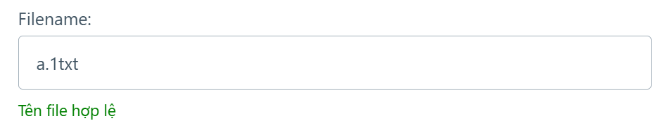
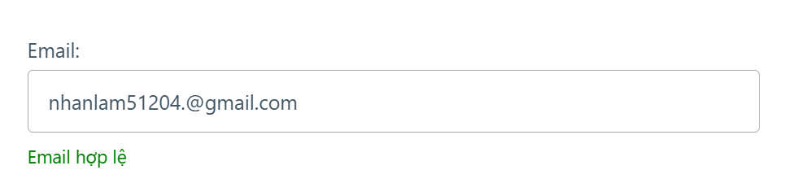
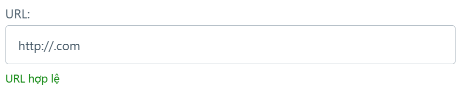
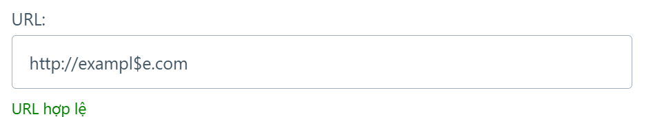

. 
Lỗi có ký tự khác trước tên file đã được sửa

. 
Lỗi có các ký tự . , ' ; trước @ vẫn basoo email hợp lệ đã được sửa.

. 
Lỗi URL để trống và có thể chèn như http://exampl$e.com có ký tự $ bị lỗi đã được sửa. 

.

 ## Kết quả: 

 - sau khi sửa lỗi thì ứng dụng hoạt động bình thường và không có lỗi. Các lỗi như URL để trống hay ký tự lạ trong tên file không còn nữa.

 - Bài làm được thực hiện bởi SV Nhan Huỳnh Lâm 
