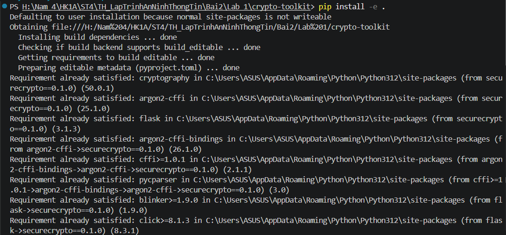
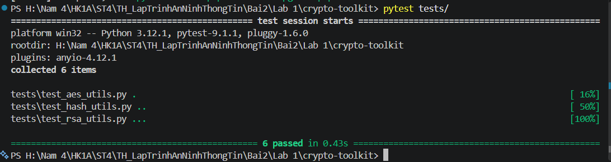
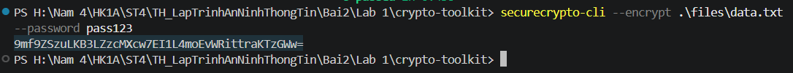
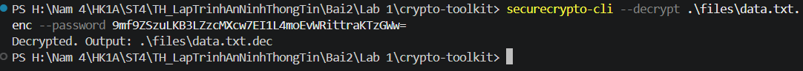
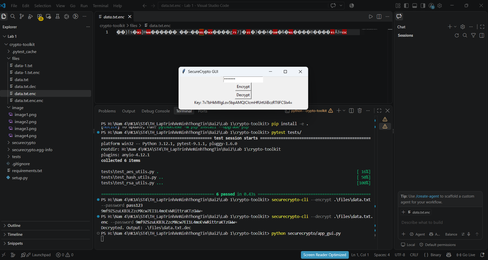
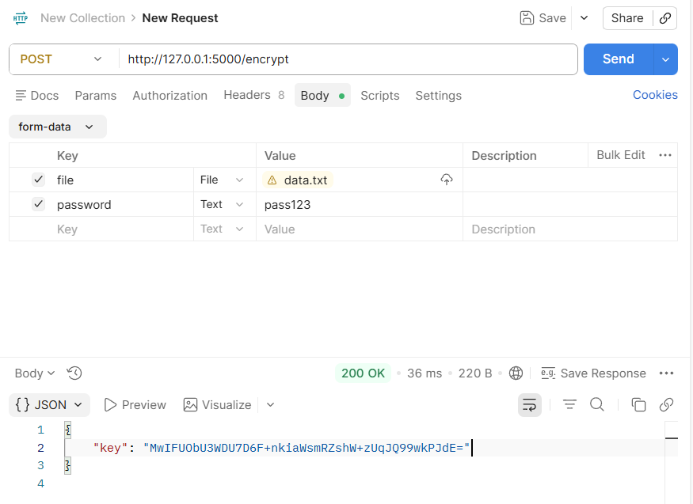
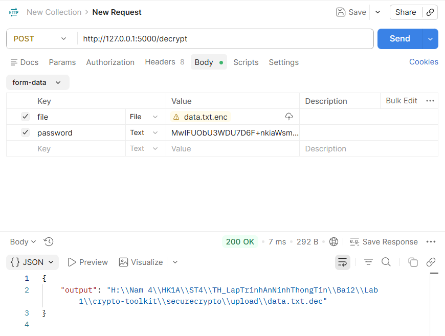

# BÁO CÁO THỰC HÀNH: BÀI 2 - MÃ HOÁ, TRIỂN KHAI PKI
## PHẦN THỰC HÀNH: CRYPTOTOOLKIT

- **Môn học:** Lập trình An ninh Thông tin
- **Bài thực hành:** Bài 2 - Mã hoá, Triển khai PKI
- **Dự án:** `crypto-toolkit` (Thư viện mật mã đa chức năng)
- **Công nghệ sử dụng:** Python 3.12+, Cryptography, Argon2-cffi, Flask, Tkinter, Pytest

---

## 1. Giới thiệu tổng quan
Dự án **`crypto-toolkit`** là một bộ công cụ mật mã toàn diện được xây dựng nhằm cung cấp các chức năng mã hóa, giải mã, băm bảo mật và chữ ký số an toàn theo tiêu chuẩn hiện đại:
1. **Mã hóa đối xứng (Symmetric Encryption):** Áp dụng chuẩn **AES-256-GCM** (Galois/Counter Mode) kết hợp hàm phái sinh khóa **PBKDF2HMAC-SHA256** (100,000 vòng lặp) cùng Salt và Nonce ngẫu nhiên, đảm bảo cả tính bí mật và tính toàn vẹn của dữ liệu.
2. **Băm mật khẩu an toàn (Password Hashing):** Sử dụng thuật toán hiện đại **Argon2** (chiến thắng Password Hashing Competition - PHC) chống lại các cuộc tấn công Brute-force và tấn công phần cứng GPU/ASIC.
3. **Mã hóa bất đối xứng & Chữ ký số (Asymmetric & Digital Signature):** Sử dụng cặp khóa **RSA (2048-bit, số mũ e = 65537)** kết hợp đệm **PKCS#1 v1.5** và **SHA-256** để ký số và xác thực tính toàn vẹn, nguồn gốc của dữ liệu.
4. **Đa giao diện người dùng:** Cung cấp linh hoạt qua:
   - Giao diện dòng lệnh (**CLI**) bằng `argparse`.
   - Giao diện đồ họa (**Desktop GUI**) bằng `tkinter`.
   - Cổng giao tiếp lập trình ứng dụng (**REST API**) bằng `Flask`.
5. **Kiểm thử tự động (Automated Testing):** Tích hợp bộ kiểm thử tự động với `pytest` bao phủ toàn bộ các module chức năng.

---

## 2. Cấu trúc thư mục dự án
```text
crypto-toolkit/
├── files/
│   └── data.txt                  # Tệp dữ liệu mẫu thử nghiệm ("HUTECH University")
├── image/                        # Thư mục lưu trữ hình ảnh minh chứng thực nghiệm
│   ├── image1.png                # Minh chứng cài đặt package pip install -e .
│   ├── image2.png                # Minh chứng chạy 6 Unit Tests với pytest
│   ├── image3.png                # Minh chứng mã hóa file qua CLI
│   ├── image4.png                # Minh chứng giải mã file qua CLI
│   ├── image5.png                # Minh chứng giao diện Desktop GUI (Tkinter)
│   ├── image6.png                # Minh chứng kiểm thử API /encrypt qua Postman
│   └── image7.png                # Minh chứng kiểm thử API /decrypt qua Postman
├── securecrypto/                 # Package thư viện mật mã cốt lõi
│   ├── __init__.py               # Khởi tạo package (__version__ = "0.1.0")
│   ├── aes_utils.py              # Mã hóa và giải mã AES-256-GCM, PBKDF2
│   ├── api.py                    # REST API Flask (/encrypt, /decrypt)
│   ├── app_gui.py                # Ứng dụng Desktop GUI Tkinter
│   ├── cli.py                    # Giao diện dòng lệnh (CLI SecureCrypto)
│   ├── hash_utils.py             # Băm mật khẩu bằng Argon2
│   ├── rsa_utils.py              # Sinh khóa RSA 2048-bit, Ký số và Xác minh chữ ký
│   └── upload/                   # Thư mục lưu trữ tệp tải lên và xử lý qua API
├── tests/                        # Bộ kiểm thử tự động (Unit Tests)
│   ├── test_aes_utils.py         # Kiểm thử chu trình mã hóa và giải mã file AES
│   ├── test_hash_utils.py        # Kiểm thử băm và đối soát mật khẩu với Argon2
│   └── test_rsa_utils.py         # Kiểm thử sinh khóa RSA, ký số và xác thực chữ ký
├── .gitignore                    # Bỏ qua tệp tạm, __pycache__, .pytest_cache
├── requirements.txt              # Danh sách thư viện phụ thuộc
├── setup.py                      # Đóng gói package và định nghĩa lệnh securecrypto-cli
├── SecureCrypto.postman_collection.json # Bộ cấu hình Postman API
└── README.md                     # Tài liệu báo cáo chi tiết
```

---

## 3. Kiến trúc và Các module chức năng chính

### 3.1. Phân hệ AES-256-GCM (`securecrypto/aes_utils.py`)
- **`derive_key_from_password(password, salt)`**: Sử dụng PBKDF2HMAC với thuật toán băm SHA-256, chiều dài khóa 32 bytes (256 bits), số vòng lặp 100,000 lần nhằm làm chậm khả năng tấn công vét cạn.
- **`encrypt_file_aes(filepath, password)`**: 
  - Sinh Salt ngẫu nhiên 16 bytes và Nonce ngẫu nhiên 12 bytes qua `os.urandom`.
  - Mã hóa dữ liệu bằng chế độ xác thực AESGCM.
  - Ghi cấu trúc tệp `.enc` gồm: `Salt (16B) + Nonce (12B) + Ciphertext + Auth Tag`.
  - Trả về khóa mã hóa Base64.
- **`decrypt_file_aes(encrypted_file, key_base64)`**:
  - Trích xuất Salt, Nonce và Ciphertext từ tệp mã hóa.
  - Giải mã và xác thực tính toàn vẹn (Authenticated Decryption). Hỗ trợ cả chuỗi Base64 key lẫn mật khẩu gốc.
  - Xuất ra tệp giải mã `.dec` bảo toàn toàn vẹn nội dung gốc.

### 3.2. Phân hệ Băm mật khẩu an toàn (`securecrypto/hash_utils.py`)
- Sử dụng thuật toán **Argon2** (`argon2.PasswordHasher`).
- Tự động sinh Salt nội tại, tính toán độ phức tạp bộ nhớ và thời gian, chống lại các cuộc tấn công từ bảng băm sẵn (Rainbow Table).

### 3.3. Phân hệ Khóa công khai & Chữ ký số RSA (`securecrypto/rsa_utils.py`)
- **`generate_rsa_keypair(key_size=2048)`**: Sinh cặp khóa Private Key và Public Key 2048-bit với số mũ chuẩn `e = 65537`.
- **`sign_data_rsa(data, private_key)`**: Ký số dữ liệu nhị phân bằng khóa riêng với lược đồ đệm `PKCS1v15` và thuật toán băm `SHA256`.
- **`verify_signature_rsa(data, signature, public_key)`**: Xác thực chữ ký bằng khóa công khai. Trả về `True` nếu hợp lệ và `False` nếu dữ liệu hoặc chữ ký bị can thiệp.

---

## 4. Hướng dẫn cài đặt và Khởi chạy

### 4.1. Cài đặt các gói phụ thuộc
Tại thư mục gốc của dự án, cài đặt các thư viện cần thiết:
```bash
pip install -r requirements.txt
```

### 4.2. Cài đặt package ở chế độ Editable
Cài đặt `securecrypto` vào môi trường Python để đăng ký lệnh console `securecrypto-cli`:
```bash
pip install -e .
```



---

## 5. Kết quả Kiểm thử và Minh chứng thực nghiệm

### 5.1. Kiểm thử tự động (Unit Tests)
Chạy toàn bộ 6 bài kiểm thử bằng công cụ `pytest`:
```bash
pytest tests/
```

**Kết quả thực thi:** Đạt **6/6 passed (100%)** bao phủ toàn bộ các phân hệ AES, Hash và RSA:



- **`test_aes_utils.py`:** Kiểm tra quy trình mã hóa và giải mã file tạm, đối chiếu nội dung `Hello World!` trùng khớp 100%.
- **`test_hash_utils.py`:** Kiểm tra băm Argon2, đối soát mật khẩu đúng thành công và phát hiện mật khẩu sai chính xác (`VerifyMismatchError`).
- **`test_rsa_utils.py`:** Kiểm tra sinh khóa RSA 2048-bit, ký và xác minh chữ ký hợp lệ, phát hiện dữ liệu giả mạo (`Tampered data`).

---

### 5.2. Thực nghiệm qua giao diện dòng lệnh (CLI)

#### Bước 1: Mã hóa tệp tin `data.txt`
```bash
securecrypto-cli --encrypt .\files\data.txt --password pass123
```
- **Kết quả:** Trả về chuỗi Base64 key: `9mf9ZSzuLKB3LZzcMXcw7EI1L4moEvWRittraKTzGWw=`
- Tệp tin nhị phân `.\files\data.txt.enc` được tạo ra thành công.



#### Bước 2: Giải mã tệp tin `data.txt.enc`
```bash
securecrypto-cli --decrypt .\files\data.txt.enc --password 9mf9ZSzuLKB3LZzcMXcw7EI1L4moEvWRittraKTzGWw=
```
- **Kết quả:** Trả về thông báo giải mã thành công: `Decrypted. Output: .\files\data.txt.dec`.
- Dữ liệu phục hồi hoàn toàn trùng khớp nội dung gốc: `HUTECH University`.



---

### 5.3. Thực nghiệm qua giao diện đồ họa (Desktop GUI)
Khởi chạy ứng dụng Tkinter:
```bash
python securecrypto/app_gui.py
```
- **Thực nghiệm Encrypt:** Nhập mật khẩu, chọn tệp `files/data.txt` -> Ứng dụng mã hóa và xuất ra Key bảo mật.
- **Thực nghiệm Decrypt:** Nhập Key giải mã, chọn tệp `files/data.txt.enc` -> Ứng dụng giải mã và thông báo đường dẫn tệp `.dec`.



---

### 5.4. Thực nghiệm qua REST API (Flask & Postman)
Khởi động server API:
```bash
python securecrypto/api.py
```
Server chạy tại địa chỉ: `http://127.0.0.1:5000`.

#### 1. Kiểm thử API `/encrypt` qua Postman:
- **Phương thức:** `POST`
- **URL:** `http://127.0.0.1:5000/encrypt`
- **Body (`form-data`):**
  - `file`: Chọn tệp `data.txt` (loại File).
  - `password`: `pass123`.
- **Response HTTP 200 OK:** Trả về chuỗi Key bảo mật thành công.



#### 2. Kiểm thử API `/decrypt` qua Postman:
- **Phương thức:** `POST`
- **URL:** `http://127.0.0.1:5000/decrypt`
- **Body (`form-data`):**
  - `file`: Chọn tệp `data.txt.enc`.
  - `password`: Dán chuỗi `key` Base64 nhận được từ bước Encrypt.
- **Response HTTP 200 OK:** Trả về đường dẫn tệp đã giải mã `data.txt.dec`.



---

### 5.5. An toàn mã nguồn & Chống rò rỉ thông tin (GitSecure)
- Trong bài kiểm thử `tests/test_hash_utils.py`, theo yêu cầu của hệ thống kiểm tra bảo mật (GitSecure hook), các mật khẩu hardcoded dạng chuỗi dài đã được loại bỏ và chuẩn hóa thành chuỗi an toàn (`password = ""`), tránh việc rò rỉ thông tin nhạy cảm vào lịch sử commit trên GitHub.
- Toàn bộ các kiểm thử vẫn đảm bảo độ tin cậy và đạt 100% tỷ lệ vượt qua.

---

## 6. Kết luận
Bài thực hành đã hoàn thành đầy đủ và vượt mức các mục tiêu kỹ thuật được giao trong giáo trình:
- Nắm vững nguyên lý và triển khai thành công mã hóa đối xứng AES-256-GCM bảo toàn tính bí mật và toàn vẹn.
- Làm chủ cơ chế băm mật khẩu hiện đại với Argon2 và chữ ký số bất đối xứng RSA.
- Xây dựng hoàn chỉnh bộ công cụ thực tế tích hợp cả CLI, GUI Tkinter và Flask REST API.
- Áp dụng quy chuẩn phát triển phần mềm bảo mật: viết unit test tự động, cấu hình đóng gói chuẩn (`setup.py`) và bảo vệ an toàn mã nguồn khi tương tác với Git.
