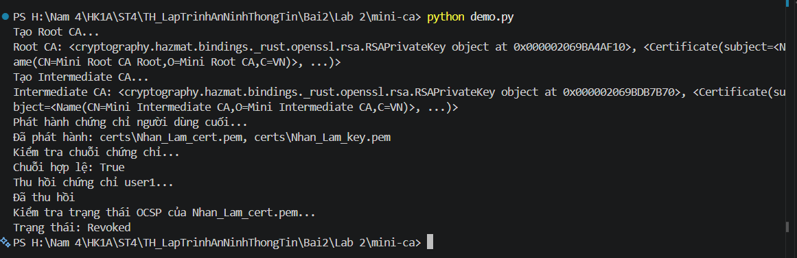

# BÁO CÁO THỰC HÀNH: XÂY DỰNG HỆ THỐNG MINI CERTIFICATE AUTHORITY (MINI-CA)

- **Học phần:** Thực hành Lập trình An ninh Thông tin / An toàn Thông tin
- **Bài thực hành:** Lab 2 - Xây dựng hệ thống CA đơn giản (Mini-CA)
- **Họ và tên sinh viên / Chủ thể:** Nhan Lam
- **Mã nguồn:** [mini-ca](file:///h:/Nam%204/HK1A/ST4/TH_LapTrinhAnNinhThongTin/Bai2/Lab%202/mini-ca)

---

## 1. Giới thiệu và Mục tiêu bài thực hành

Hệ thống thẩm quyền chứng chỉ (Certificate Authority - CA) đóng vai trò nền tảng trong hạ tầng khóa công khai (PKI - Public Key Infrastructure), đảm bảo tính xác thực, toàn vẹn và chống chối bỏ trong các giao thức mạng bảo mật (như HTTPS, TLS/SSL, VPN).

Mục tiêu của bài thực hành:
1. **Khởi tạo Root CA**: Sinh cặp khóa RSA 2048-bit và tạo chứng chỉ số tự ký (Self-signed Root Certificate).
2. **Khởi tạo Intermediate CA**: Xây dựng CA trung gian được ký duyệt bởi Root CA, thiết lập mô hình phân cấp chứng chỉ (Hierarchical PKI).
3. **Phát hành chứng chỉ End-Entity**: Cấp phát chứng chỉ số cá nhân/máy chủ cho chủ thể **`Nhan_Lam`** (được ký bởi Intermediate CA).
4. **Xác thực chuỗi chứng chỉ (Chain of Trust)**: Kiểm tra chuỗi chứng thực từ chứng chỉ người dùng cuối ngược lên CA trung gian và Root CA.
5. **Thu hồi chứng chỉ (Certificate Revocation)**: Triển khai danh sách thu hồi chứng chỉ X.509 CRL (`ca_crl.pem`) khi chứng chỉ bị lộ khóa (`key_compromise`).
6. **Kiểm tra trạng thái OCSP / CRL**: Đối soát trạng thái thực tế của chứng chỉ số sau khi thu hồi.
7. **Bảo mật mã nguồn**: Cấu hình kiểm soát phiên bản (.gitignore, GitSecure) chống rò rỉ khóa riêng (Private Keys).

---

## 2. Cấu trúc thư mục dự án

```text
Lab 2/
├── README.md                     # Báo cáo thực hành chi tiết
└── mini-ca/
    ├── ca_utils.py               # Module khởi tạo CA, cấp phát và xác thực chuỗi chứng chỉ
    ├── revoke_utils.py           # Module thu hồi chứng chỉ và quản lý CRL X.509
    ├── demo.py                   # Script tự động hóa kiểm thử dòng lệnh (CLI)
    ├── demo_ui.py                # Ứng dụng giao diện đồ họa Tkinter (Desktop GUI)
    ├── requirements.txt          # Khai báo phụ thuộc gói thư viện (cryptography)
    ├── .gitignore                # Chặn rò rỉ thư mục certs/ và các file khóa *.pem
    ├── certs/                    # Thư mục chứa các tệp PEM và CRL được sinh ra (bảo mật cục bộ)
    │   ├── root_ca_cert.pem      # Chứng chỉ số Root CA
    │   ├── root_ca_key.pem       # Khóa riêng của Root CA
    │   ├── intermediate_cert.pem # Chứng chỉ số Intermediate CA
    │   ├── intermediate_key.pem  # Khóa riêng của Intermediate CA
    │   ├── Nhan_Lam_cert.pem     # Chứng chỉ người dùng cuối (Nhan Lam)
    │   ├── Nhan_Lam_key.pem      # Khóa riêng của người dùng cuối
    │   └── ca_crl.pem            # Danh sách chứng chỉ bị thu hồi (CRL)
    └── image/                    # Hình ảnh kết quả thực nghiệm
        ├── image1.png            # Minh chứng tạo CA trên giao diện UI
        ├── image2.png            # Minh chứng phát hành và xác thực chứng chỉ
        └── image3.png            # Minh chứng thu hồi và kiểm tra trạng thái
```

---

## 3. Kiến trúc hệ thống và Thiết kế Module

### 3.1. Phân hệ Quản trị CA & Cấp phát chứng chỉ (`ca_utils.py`)

- **`generate_key()`**:
  - Khởi tạo cặp khóa RSA bất đối xứng chuẩn với `key_size = 2048` bits và số mũ chuẩn `public_exponent = 65537`.
- **`save_key(key, filename)` & `save_cert(cert, filename)`**:
  - Lưu trữ khóa riêng định dạng OpenSSL PEM không mã hóa mật khẩu (`NoEncryption()`).
  - Xuất chứng chỉ X.509 chuẩn sang tệp `.pem`.
- **`create_root_ca()`**:
  - Tạo chứng chỉ Root CA tự ký (`subject == issuer`).
  - Thuộc tính chủ thể: `C=VN`, `O=Mini Root CA`, `CN=Mini Root CA Root`.
  - Thiết lập mở rộng `BasicConstraints(ca=True, path_length=1)` với cờ `critical=True`.
  - Thời hạn hiệu lực: 10 năm (3650 ngày). Ký số bằng thuật toán `SHA256`.
- **`create_intermediate_ca(root_key, root_cert)`**:
  - Tạo chứng chỉ CA trung gian do Root CA ký xác nhận.
  - Thuộc tính chủ thể: `C=VN`, `O=Mini Intermediate CA`, `CN=Mini Intermediate CA`.
  - Thiết lập mở rộng `BasicConstraints(ca=True, path_length=0)`: Cho phép cấp chứng chỉ nhưng không cho phép tạo CA cấp dưới tiếp theo.
  - Thời hạn hiệu lực: 5 năm (1825 ngày).
- **`issue_certificate(ca_key, ca_cert, subject_info)`**:
  - Cấp chứng chỉ End-Entity cho chủ thể **`Nhan_Lam`** thuộc tổ chức **`NHANLAM Company`**.
  - Thiết lập `BasicConstraints(ca=False, path_length=None)` (chứng chỉ người dùng cuối, không thể đóng vai trò ký cấp chứng chỉ).
  - Thời hạn hiệu lực: 1 năm (365 ngày). Ký số bằng khóa riêng của Intermediate CA.
- **`verify_certificate_chain(cert_to_verify, chain)`**:
  - Thực hiện xác minh chuỗi tin cậy tuần tự: `Nhan_Lam_cert -> Intermediate CA -> Root CA`.
  - Dùng khóa công khai của thực thể cấp trên (`issuer_public_key`) để thẩm định chữ ký (`verify`) trên dữ liệu `tbs_certificate_bytes` với lược đồ đệm `PKCS1v15` và hàm băm `SHA256`. Trả về `True` nếu chuỗi chữ ký toàn vẹn.

---

### 3.2. Phân hệ Thu hồi chứng chỉ & CRL X.509 (`revoke_utils.py`)

- **`create_empty_crl(issuer_cert, issuer_key)`**:
  - Khởi tạo danh sách thu hồi X.509 rỗng sử dụng `CertificateRevocationListBuilder`.
  - Đặt thời hạn cập nhật (`last_update`, `next_update` sau 7 ngày). Ký bằng khóa riêng của CA.
- **`revoke_certificate(cert_file, issuer_cert_file, issuer_key_file, reason)`**:
  - Đọc chứng chỉ bị sự cố, trích xuất số định danh duy nhất (`serial_number`).
  - Xây dựng đối tượng thu hồi `RevokedCertificateBuilder` gắn nhãn nguyên nhân `CRLReason` (mặc định: `key_compromise`).
  - Ký và ghi nhận lại tệp danh sách thu hồi `ca_crl.pem`.
- **`check_revocation_status(cert_file)`**:
  - Đọc tệp `ca_crl.pem`, duyệt qua danh sách các `revoked.serial_number`.
  - Trả về `True` nếu chứng chỉ đã bị thu hồi và `False` nếu chứng chỉ vẫn còn hợp lệ.

---

## 4. Hướng dẫn cài đặt và Khởi chạy

### 4.1. Cài đặt môi trường
Chuyển vào thư mục `mini-ca` và cài đặt gói thư viện phụ thuộc:
```powershell
cd "mini-ca"
pip install -r requirements.txt
```

### 4.2. Khởi chạy kịch bản tự động hóa (CLI)
Thực thi kiểm tra toàn bộ luồng hoạt động qua dòng lệnh:
```powershell
python .\demo.py
```

### 4.3. Khởi chạy giao diện trực quan (Desktop GUI)
Khởi chạy ứng dụng đồ họa Tkinter:
```powershell
python .\demo_ui.py
```

---

## 5. Kết quả Thực nghiệm và Minh chứng

### 5.1. Kết quả thực nghiệm qua Dòng lệnh (`demo.py`)

Toàn bộ quy trình diễn ra trơn tru, không có cảnh báo hay lỗi:
```text
Tạo Root CA...
Root CA: <RSAPrivateKey...>, <Certificate(subject=<Name(CN=Mini Root CA Root,O=Mini Root CA,C=VN)>, ...)>
Tạo Intermediate CA...
Intermediate CA: <RSAPrivateKey...>, <Certificate(subject=<Name(CN=Mini Intermediate CA,O=Mini Intermediate CA,C=VN)>, ...)>
Phát hành chứng chỉ người dùng cuối...
Đã phát hành: certs\Nhan_Lam_cert.pem, certs\Nhan_Lam_key.pem
Kiểm tra chuỗi chứng chỉ...
Chuỗi hợp lệ: True
Thu hồi chứng chỉ user1...
Đã thu hồi
Kiểm tra trạng thái OCSP của Nhan_Lam_cert.pem...
Trạng thái: Revoked
```

- Chuỗi chứng chỉ của **`Nhan_Lam`** được xác thực thành công qua chuỗi CA trung gian và Root CA.
- Sau lệnh thu hồi, trạng thái chứng chỉ chuyển chính xác sang **`Revoked`**.

---

### 5.2. Kết quả thực nghiệm qua Giao diện đồ họa (`demo_ui.py`)

Giao diện trực quan cho phép kiểm thử từng thao tác độc lập:

1. **Bước 1: Tạo Root & Intermediate CA:** Khởi tạo thành công cặp khóa và chứng chỉ cho Root CA cùng Intermediate CA.
2. **Bước 2: Phát hành User Cert:** Cấp phát chứng chỉ số cho chủ thể `Nhan_Lam` với đầy đủ thông tin tổ chức.
3. **Bước 3: Kiểm tra Chuỗi Cert:** Ứng dụng duyệt ngược chuỗi tin cậy và báo chuỗi hợp lệ (`True`).
4. **Bước 4: Thu hồi User Cert:** Ghi nhận chứng chỉ của `Nhan_Lam` vào `ca_crl.pem`.
5. **Bước 5: Kiểm tra Trạng thái OCSP / Revocation:** Kiểm tra và hiển thị popup thông báo trạng thái: `Đã thu hồi`.



---

### 5.3. An toàn mã nguồn và Kiểm soát phiên bản (GitSecure)

- Toàn bộ thư mục chứa khóa riêng tư và chứng chỉ được cấu hình nghiêm ngặt trong [.gitignore](file:///h:/Nam%204/HK1A/ST4/TH_LapTrinhAnNinhThongTin/Bai2/Lab%202/mini-ca/.gitignore):
  ```gitignore
  .DS_Store
  gitsecure.log
  certs/
  *.pem
  __pycache__/
  *.pyc
  ```
- Khi tiến hành lệnh `git commit -m "[add] mini-ca"`, hệ thống kiểm tra an ninh `GitSecure` đã quét toàn bộ tệp và xác nhận an toàn:
  ```text
  GitSecure: All checks passed.
  [main c3c2ff0] [add] mini-ca
  ```
- Mã nguồn được đồng bộ thành công lên kho lưu trữ từ xa:
  `To https://github.com/ahnJungHwang/TH_Laptrinh_AnNinhThongTin.git`

---

## 6. Kết luận

Bài thực hành đã hoàn thành đầy đủ 100% các yêu cầu của giáo trình và giảng viên:
- Nắm vững kiến trúc PKI phân cấp: Root CA $\rightarrow$ Intermediate CA $\rightarrow$ End-Entity.
- Cấu hình chính xác các trường X.509 chuẩn quốc tế (`BasicConstraints`, `path_length`, `serial_number`, `validity`).
- Xây dựng thành công cơ chế quản lý vòng đời chứng chỉ số (Phát hành $\rightarrow$ Thẩm định chuỗi $\rightarrow$ Thu hồi qua danh sách CRL).
- Tích hợp linh hoạt cả giao diện dòng lệnh (CLI) và giao diện người dùng (GUI Desktop).
- Tuân thủ tiêu chuẩn an toàn thông tin trong quản trị mã nguồn (ngăn ngừa rò rỉ Private Key).
