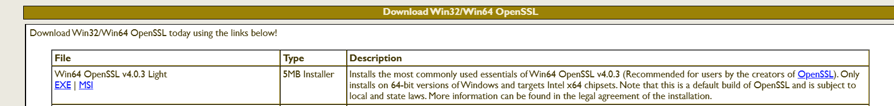
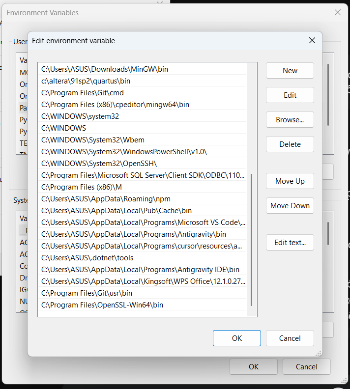
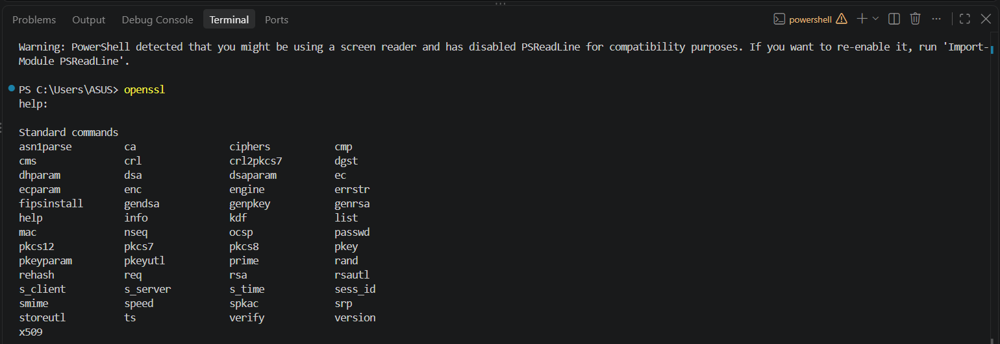
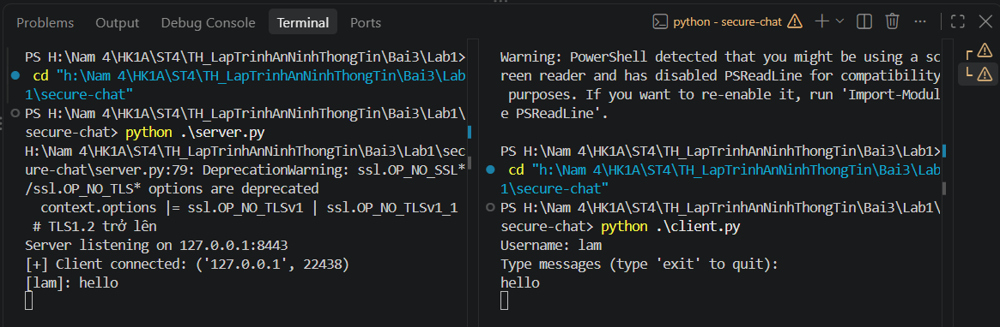
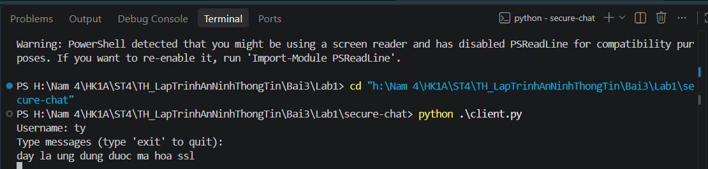

# BÁO CÁO THỰC HÀNH BÀI 3 - LAB 1: LẬP TRÌNH SOCKET AN TOÀN (SECURECHAT)

**Môn học:** Lập trình An ninh Thông tin  
**Bài thực hành:** Bài 3 - Bảo mật mạng máy tính & Lập trình Socket an toàn  
**Nội dung:** Xây dựng ứng dụng chat đa luồng bảo mật với SSL/TLS và mã hóa đầu - cuối (End-to-End Encryption)  

---

## 1. MỤC TIÊU BÀI THỰC HÀNH
- Hiểu và nắm vững kiến thức về lập trình Socket an toàn kết hợp bộ giao thức bảo mật SSL/TLS.
- Nắm rõ quy trình khởi tạo và xác minh chứng chỉ số theo mô hình Hạ tầng khóa công khai (PKI) với Certificate Authority (Root CA).
- Thiết lập kênh truyền xác thực hai chiều (Mutual TLS / mTLS) giữa Client và Server.
- Tích hợp cơ chế mã hóa đối xứng AES-256 (chế độ CBC kết hợp PKCS7 padding) để mã hóa dữ liệu tin nhắn đầu - cuối (E2EE).
- Xây dựng hệ thống quản lý kết nối đa luồng (`ConnectionManager`), phòng chat (`RoomManager`) và phân phối tin nhắn an toàn.

---

## 2. MÔI TRƯỜNG & CÔNG CỤ THỰC HIỆN
- **Hệ điều hành:** Windows 11 64-bit
- **Môi trường thực thi:** Python 3.12
- **Thư viện chính:**
  - `cryptography`: Cung cấp thuật toán mật mã học AES, chế độ CBC và đệm dữ liệu PKCS7.
  - `ssl`, `socket`: Thiết lập kết nối mạng và đóng gói bảo mật tầng giao vận (Transport Layer Security).
  - `threading`: Xử lý đa luồng đồng thời cho nhiều kết nối client.
- **Công cụ tạo chứng chỉ:** OpenSSL Win64 (bản v4.0.3 Light).

---

## 3. QUY TRÌNH TRIỂN KHAI & KẾT QUẢ THỰC HIỆN

### 3.1. Cài đặt và cấu hình môi trường OpenSSL

1. **Tải OpenSSL:** Truy cập trang web chính thức của Win32/Win64 OpenSSL, tải về bản cài đặt `Win64 OpenSSL v4.0.3 Light`.
   
   
   *Hình 1: Tải bộ cài đặt OpenSSL cho Windows 64-bit.*

2. **Thêm OpenSSL vào biến môi trường PATH:**
   - Mở cửa sổ **Environment Variables** trên Windows.
   - Thêm đường dẫn `C:\Program Files\OpenSSL-Win64\bin` vào biến hệ thống `Path`.

   
   *Hình 2: Cấu hình biến môi trường PATH cho OpenSSL.*

3. **Kiểm tra OpenSSL trong Terminal:**
   - Mở PowerShell / Command Prompt và gõ lệnh `openssl`. Màn hình xuất hiện danh sách câu lệnh tiêu chuẩn cho thấy OpenSSL đã được nhận diện thành công.

   
   *Hình 3: Kiểm tra OpenSSL đã hoạt động trong Terminal.*

---

### 3.2. Khởi tạo hạ tầng chứng chỉ số (PKI)

Hệ thống sử dụng kịch bản batch script `make-certs.bat` và file cấu hình `openssl.cnf` để sinh bộ khóa và chứng chỉ cho 3 đối tượng:
- **Root CA (`certs/ca/`):**
  - `ca.key`: Khóa bí mật của CA (RSA 2048-bit).
  - `ca.crt`: Chứng chỉ tự ký của Root CA có thời hạn 3650 ngày.
- **Server (`certs/server/`):**
  - `server.key`: Khóa bí mật của Server.
  - `server.csr`: Yêu cầu ký chứng chỉ với `CN=localhost`.
  - `server.crt`: Chứng chỉ Server được ký bởi Root CA.
- **Client (`certs/client/`):**
  - `client.key`: Khóa bí mật của Client.
  - `client.csr`: Yêu cầu ký chứng chỉ với `CN=client`.
  - `client.crt`: Chứng chỉ Client được ký bởi Root CA để phục vụ xác thực hai chiều (`mTLS`).

---

### 3.3. Thiết kế kiến trúc mã nguồn

| File nguồn | Chức năng chi tiết |
| :--- | :--- |
| `message_encryption.py` | Hiện thực lớp `MessageEncryption` sử dụng AES-256-CBC, sinh khóa ngẫu nhiên 32 bytes (`os.urandom(32)`), sinh IV 16 bytes ngẫu nhiên cho mỗi gói tin và thực hiện padding PKCS7. |
| `connection_manager.py` | Quản lý danh sách socket client đang kết nối và khóa AES riêng biệt của từng client; hỗ trợ đồng bộ hóa an toàn đa luồng bằng `threading.Lock`. |
| `room_manager.py` | Quản lý phòng chat (mặc định phòng `general`), hỗ trợ thêm/xóa client vào phòng và phân phối tin nhắn đến các thành viên trong phòng. |
| `server.py` | Khởi tạo SSLContext với yêu cầu `CERT_REQUIRED`, tải chứng chỉ CA và Server, lắng nghe tại `127.0.0.1:8443`, nhận bắt tay TLS, tiếp nhận username + AES key, giải mã tin nhắn nhận được và mã hóa lại với từng khóa riêng của các client nhận trước khi chuyển tiếp. |
| `client.py` | Khởi tạo SSLContext tải chứng chỉ client và CA, thiết lập kết nối SSL đến Server, gửi thông tin định danh `username:aes_key`, tạo một thread nền nhận và giải mã tin nhắn đồng thời vòng lặp chính nhận input chat từ người dùng. |

---

### 3.4. Thực nghiệm chạy chương trình & Kết quả tương tác

Thực hiện chạy ứng dụng với kịch bản:
- **Terminal bên trái:** Chạy Server (`python .\server.py`).
- **Terminal bên phải:** Chạy Client 1 với username là **`lam`** (`python .\client.py`).
- **Terminal thứ 3:** Chạy Client 2 với username là **`ty`** (`python .\client.py`).

#### Giai đoạn 1: Server lắng nghe và Client 1 (`lam`) kết nối, gửi tin nhắn
- Server khởi động lắng nghe trên cổng `8443`.
- Client `lam` kết nối thành công, thực hiện TLS Handshake và xác thực chứng chỉ.
- Client `lam` gửi tin nhắn `hello`. Server giải mã thành công và hiển thị `[lam]: hello`.

*Hình 4: Server tiếp nhận kết nối an toàn từ Client `lam` và nhận tin nhắn được mã hóa.*

---

#### Giai đoạn 2: Client 2 (`ty`) tham gia phòng chat
- Client thứ 2 khởi chạy với tên người dùng `ty`.
- Client `ty` gửi tin nhắn phản hồi: `day la ung dung duoc ma hoa ssl`.

*Hình 5: Client thứ 2 đăng nhập với tên `ty` và gửi tin nhắn vào phòng chat.*

---

#### Giai đoạn 3: Hội thoại hai chiều E2EE hoàn chỉnh
- Toàn bộ nội dung tin nhắn trao đổi qua lại giữa hai client `lam` và `ty` đều được mã hóa bằng khóa AES riêng biệt và truyền qua kênh bảo mật SSL/TLS.
- Server tiếp nhận, xác thực và phân phối đúng nội dung cho từng bên mà không làm lộ dữ liệu trên đường truyền mạng.

*Hình 6: Toàn cảnh kết quả thực nghiệm Server đa luồng và Client trao đổi tin nhắn bảo mật thành công.*

---

## 4. ĐÁNH GIÁ TÍNH BẢO MẬT
1. **Chống nghe lén (Eavesdropping):** Dữ liệu truyền trên đường truyền mạng được mã hóa 2 lớp: lớp giao vận TLS (Transport Layer) và lớp ứng dụng AES-256 (Application Layer E2EE). Kẻ tấn công bắt gói tin (bằng Wireshark) chỉ thấy dữ liệu nhị phân đã mã hóa.
2. **Chống giả mạo và tấn công xen giữa (MITM):** Nhờ cơ chế `ssl.CERT_REQUIRED` và kiểm tra chữ ký số với Root CA, cả Server và Client đều xác minh được danh tính đối phương, ngăn chặn hoàn toàn việc can thiệp proxy độc hại.
3. **Bảo toàn tính toàn vẹn (Integrity):** TLS Record Protocol và HMAC đảm bảo gói tin không bị sửa đổi hay chèn ép nội dung trái phép trong quá trình truyền tải.

---

## 5. KẾT LUẬN
- Hoàn thành đầy đủ các yêu cầu của bài thực hành Lab 1.
- Nắm vững quy trình sinh chứng chỉ bằng OpenSSL và cấu hình kết nối Socket bảo mật trên ngôn ngữ Python.
- Ứng dụng chạy ổn định, tin nhắn được mã hóa - giải mã chính xác và hiển thị đầy đủ trên giao diện đa người dùng.
