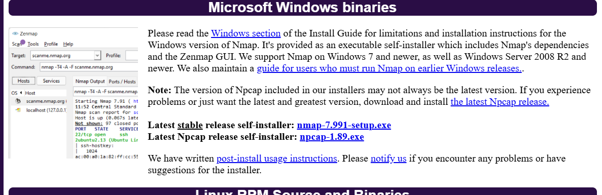
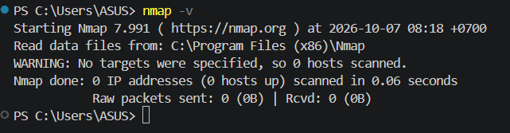
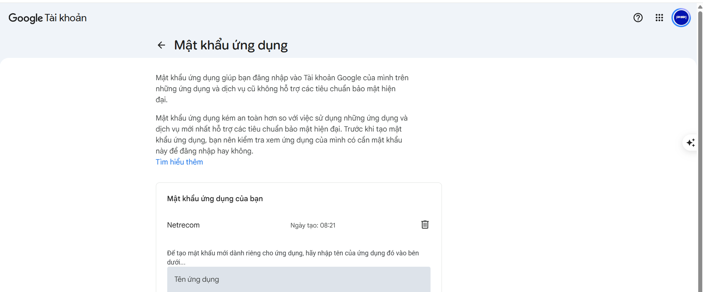
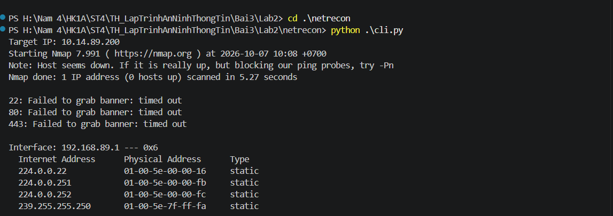
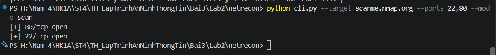
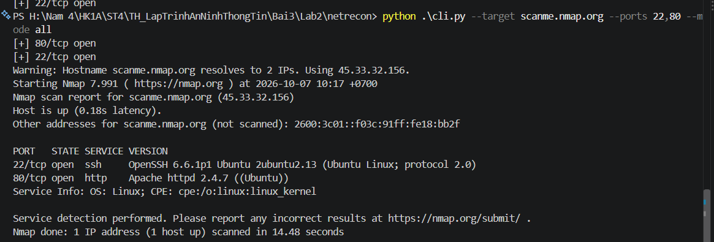
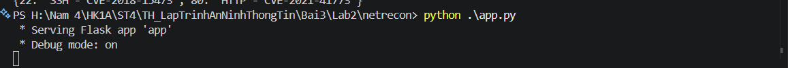
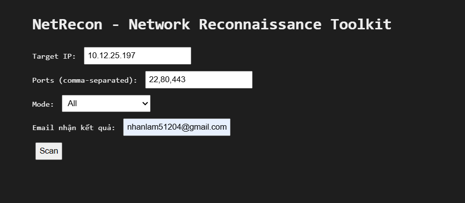
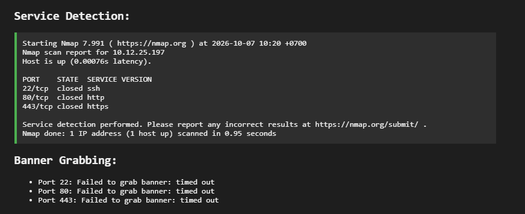
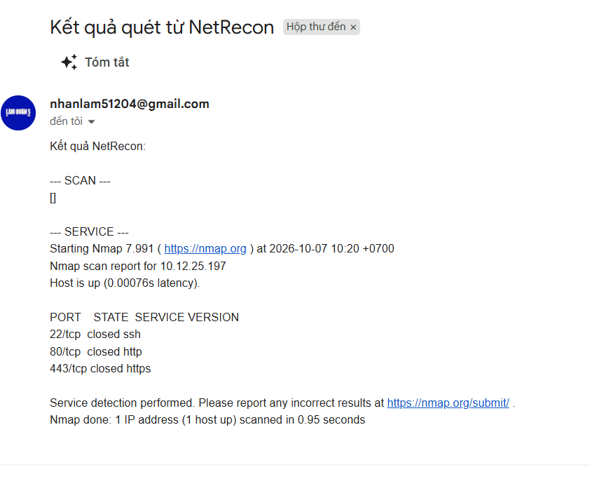

# BÁO CÁO THỰC HÀNH BÀI 3 - LAB 2: QUÉT MẠNG VÀ TRINH SÁT (NETRECON TOOLKIT)

**Môn học:** Lập trình An ninh Thông tin  
**Bài thực hành:** Bài 3 - Bảo mật mạng máy tính & Trinh sát mạng  
**Nội dung:** Xây dựng bộ công cụ trinh sát mạng NetRecon (Port Scanner, Service Detector, Banner Grabber, Network Mapper, Vuln Checker, Web UI & Email Notification)  

---

## 1. MỤC TIÊU BÀI THỰC HÀNH
- Hiểu rõ nguyên lý và các kỹ thuật quét cổng (Port Scanning), nhận biết trạng thái các cổng mạng (Open, Closed, Filtered).
- Ứng dụng lập trình bất đồng bộ (`asyncio`) kết hợp biến đếm giới hạn (`asyncio.Semaphore`) để thực hiện quét cổng hiệu năng cao có kiểm soát tốc độ (Rate Limiting).
- Tích hợp công cụ phân tích mạng tiêu chuẩn công nghiệp Nmap (`nmap -sV`) để nhận dạng dịch vụ (Service Fingerprinting / Detection).
- Thực hiện kỹ thuật thu thập thông tin banner (Banner Grabbing) trực tiếp qua kết nối TCP Socket.
- Khám phá cấu trúc mạng cục bộ (Network Mapping) dựa trên bảng phân giải địa chỉ ARP (`arp -a`).
- Đối soát thông tin cổng dịch vụ với cơ sở dữ liệu lỗ hổng bảo mật phổ biến (CVE - Common Vulnerabilities and Exposures).
- Triển khai ứng dụng trên 2 giao diện: Giao diện dòng lệnh CLI linh hoạt (`click`) và Giao diện Web tương tác (`Flask` + `HTMX`), tích hợp chức năng thông báo kết quả tự động qua email bảo mật (SMTP SSL).

---

## 2. MÔI TRƯỜNG & CÔNG CỤ THỰC HIỆN
- **Hệ điều hành:** Windows 11 64-bit
- **Môi trường lập trình:** Python 3.12
- **Công cụ phân tích mạng:** Nmap 7.991 (kèm Npcap 1.88)
- **Thư viện Python chính:**
  - `flask`: Framework phục vụ Web Server và render template.
  - `click`: Thư viện xây dựng giao diện dòng lệnh đa tham số chuyên nghiệp.
  - `asyncio`: Xử lý I/O bất đồng bộ quét nhiều cổng đồng thời.
  - `smtplib`, `email`: Kết nối máy chủ thư điện tử qua cổng 465 (SMTP over SSL).
  - `python-dotenv`: Nạp biến môi trường an toàn từ file cấu hình bí mật `.env`.
  - `subprocess`: Thực thi các lệnh hệ thống `nmap` và `arp`.

---

## 3. THIẾT KẾ HỆ THỐNG VÀ CÁC MODULE CHỨC NĂNG

Hệ thống được tổ chức dạng module hóa rõ ràng trong thư mục `netrecon`:

| Module / Tệp tin | Chức năng chi tiết |
| :--- | :--- |
| `modules/port_scanner.py` | Quét cổng TCP bất đồng bộ bằng `asyncio.open_connection()`. Sử dụng `asyncio.Semaphore(rate_limit)` (mặc định 100 kết nối đồng thời) để hạn chế nghẽn mạng và ghi nhật ký hoạt động vào file `netrecon.log`. |
| `modules/service_detector.py` | Gọi công cụ Nmap thông qua lệnh `nmap -sV -p <ports> <ip>` bằng `subprocess.check_output()`, phát hiện tên ứng dụng, dịch vụ và phiên bản chi tiết đang lắng nghe. |
| `modules/banner_grabber.py` | Thiết lập kết nối Socket TCP với timeout 2 giây, đọc dữ liệu chào ban đầu (`banner = s.recv(1024)`) để xác định thông tin phiên bản phần mềm. |
| `modules/network_mapper.py` | Thu thập bảng ánh xạ IP - MAC trong mạng cục bộ thông qua lệnh `arp -a`. |
| `modules/vuln_checker.py` | Đối chiếu danh sách cổng mở với từ điển lỗ hổng mẫu (`VULN_PORTS`) để cảnh báo các mã CVE nghiêm trọng (FTP CVE-2015-3306, SSH CVE-2018-15473, HTTP CVE-2021-41773, HTTPS CVE-2021-3449,...). |
| `modules/email_sender.py` | Soạn thảo email bằng `EmailMessage` và gửi báo cáo qua máy chủ `smtp.gmail.com:465` sử dụng phương thức mã hóa SSL. |
| `modules/filter_utils.py` | Cung cấp hàm lọc mục tiêu IP theo danh sách cho phép (Whitelist) hoặc danh sách chặn (Blacklist). |
| `cli.py` | Giao diện dòng lệnh hỗ trợ các tùy chọn: `--target`, `--ports`, `--rate-limit`, `--mode` (`scan`, `service`, `banner`, `map`, `vuln`, `all`). |
| `app.py` | Máy chủ web Flask lắng nghe tại `0.0.0.0:5000`, xử lý route `/` và `/scan`, render kết quả ra template HTML và tự động gửi email báo cáo. |

---

## 4. QUY TRÌNH TRIỂN KHAI & KẾT QUẢ THỰC NGHIỆM

### 4.1. Cài đặt Nmap và kiểm tra biến môi trường
1. **Tải bộ cài Nmap:** Truy cập website chính thức `nmap.org`, tải bản cài đặt `nmap-7.991-setup.exe` cho Windows.
   
   
   *Hình 1: Trang tải bộ cài đặt Nmap cho hệ điều hành Windows.*

2. **Kiểm tra công cụ Nmap trong Terminal:**
   - Chạy lệnh `nmap -v` trong PowerShell để kiểm tra phiên bản và đường dẫn nạp dữ liệu. Kết quả xác nhận phiên bản Nmap 7.991 đã sẵn sàng hoạt động.

   
   *Hình 2: Kiểm tra cài đặt Nmap thành công trong PowerShell.*

---

### 4.2. Cấu hình Mật khẩu ứng dụng Google (Gmail App Password)
Để gửi thông báo kết quả quét qua email một cách an toàn mà không làm lộ mật khẩu chính của tài khoản Google:
- Truy cập cài đặt tài khoản Google (`myaccount.google.com/apppasswords`).
- Tạo mật khẩu ứng dụng mới với tên ứng dụng **`Netrecon`**.
- Lưu chuỗi mật khẩu 16 ký tự vào file cấu hình bảo mật `.env` (`SMTP_USER` và `SMTP_PASS`).


*Hình 3: Khởi tạo mật khẩu ứng dụng Gmail cho toolkit NetRecon.*

---

### 4.3. Kiểm thử giao diện dòng lệnh (CLI)

#### Thử nghiệm 1: Quét tương tác (Interactive Mode)
Chuyển vào thư mục `netrecon` và chạy:
```powershell
cd .\netrecon
python .\cli.py
```
Nhập IP mục tiêu để kiểm tra tuần tự tất cả các bước: phát hiện host, lấy banner, đọc bảng ARP mạng và liệt kê cảnh báo CVE.


*Hình 4: Chạy kiểm thử CLI tương tác trên IP nội bộ.*

---

#### Thử nghiệm 2: Quét nhanh cổng mở (`--mode scan`)
Kiểm tra tính năng quét cổng bất đồng bộ trên server thử nghiệm chính thức `scanme.nmap.org` trên 2 cổng 22 và 80:
```powershell
python cli.py --target scanme.nmap.org --ports 22,80 --mode scan
```
- Kết quả phản hồi chính xác trạng thái mở:
  ```text
  [+] 80/tcp open
  [+] 22/tcp open
  ```


*Hình 5: Quét nhanh phát hiện cổng 22 và 80 đang mở trên máy chủ đích.*

---

#### Thử nghiệm 3: Quét toàn diện tích hợp Nmap (`--mode all`)
Thực hiện quét đầy đủ tất cả chế độ đối với `scanme.nmap.org`:
```powershell
python .\cli.py --target scanme.nmap.org --ports 22,80 --mode all
```
- Module `service_detector` gọi Nmap và trích xuất thành công phiên bản chính xác của dịch vụ:
  - Cổng 22: `OpenSSH 6.6.1p1 Ubuntu`
  - Cổng 80: `Apache httpd 2.4.7 ((Ubuntu))`


*Hình 6: Nmap nhận dạng chính xác phiên bản OpenSSH và Apache trên server mục tiêu.*

---

### 4.4. Triển khai và kiểm thử giao diện Web (Flask Web App)

#### 1. Khởi động Web Server:
Khởi chạy ứng dụng Flask:
```powershell
python .\app.py
```
Hệ thống kích hoạt server ở chế độ Debug trên cổng 5000 (`http://127.0.0.1:5000`).


*Hình 7: Khởi động máy chủ web Flask.*

---

#### 2. Thao tác trên giao diện Web:
Truy cập `http://localhost:5000/` trên trình duyệt:
- **Target IP:** `10.12.25.197`
- **Ports (comma-separated):** `22,80,443`
- **Mode:** `All`
- **Email nhận kết quả:** `nhanlam51204@gmail.com`
- Nhấn nút **Scan** để bắt đầu tiến trình trinh sát.


*Hình 8: Nhập thông số cấu hình quét trên giao diện Web NetRecon.*

---

#### 3. Kết quả phản hồi trên trình duyệt:
Giao diện hiển thị trực quan các khối thông tin kết quả:
- **Service Detection:** Báo cáo từ Nmap cho thấy tình trạng cổng và dịch vụ trên máy đích.
- **Banner Grabbing:** Chi tiết trạng thái thu thập banner cho từng cổng.


*Hình 9: Kết quả trinh sát mạng hiển thị chi tiết trên giao diện Web.*

---

#### 4. Báo cáo tự động qua Email:
Ngay sau khi tiến trình quét hoàn tất, hệ thống tự động tổng hợp dữ liệu và gửi thông báo qua giao thức SMTP SSL về hòm thư Gmail `nhanlam51204@gmail.com`.


*Hình 10: Email thông báo kết quả quét từ hệ thống NetRecon gửi về hòm thư người dùng.*

---

## 5. PHÂN TÍCH VÀ ĐÁNH GIÁ KỸ THUẬT

1. **Hiệu năng và cơ chế Rate Limiting:**
   - Việc sử dụng `asyncio` giúp gửi nhiều gói tin thăm dò cùng lúc mà không gây nghẽn luồng chính.
   - Cơ chế giới hạn số lượng tác vụ đồng thời qua `Semaphore` bảo vệ hệ thống khỏi việc làm tràn băng thông mạng hoặc bị tường lửa/hệ thống IDS/IPS nhận diện là hành vi tấn công từ chối dịch vụ (DoS).

2. **Kết hợp giữa Quét chủ động và Quét thụ động:**
   - Quét chủ động (Active): Thiết lập kết nối TCP, gọi Nmap `sV` để tương tác trực tiếp với dịch vụ mục tiêu.
   - Quét dựa trên dữ liệu có sẵn: Thu thập bảng ARP (`arp -a`) để phát hiện các thiết bị lân cận mà không cần gửi gói tin thăm dò trực tiếp đến từng host.

3. **Cảnh báo an ninh sớm:**
   - Module `vuln_checker` hỗ trợ cảnh báo tức thời các lỗ hổng đã biết (CVE) giúp quản trị viên chủ động cập nhật bản vá hoặc cấu hình lại tường lửa kịp thời.

---

## 6. KẾT LUẬN
- Bộ công cụ **NetRecon** đã được triển khai hoàn chỉnh, đáp ứng đầy đủ tất cả các yêu cầu kỹ thuật trong bài học.
- Chương trình hoạt động ổn định trên cả giao diện dòng lệnh (CLI) và giao diện Web (Flask), có tích hợp ghi log và gửi thông báo email tự động.
- Nắm vững quy trình trinh sát mạng và các kỹ thuật quét cổng, nhận dạng dịch vụ cơ bản trong An ninh thông tin.
